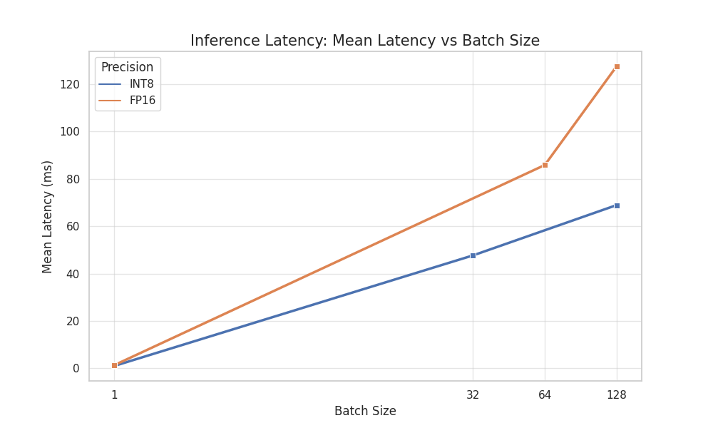
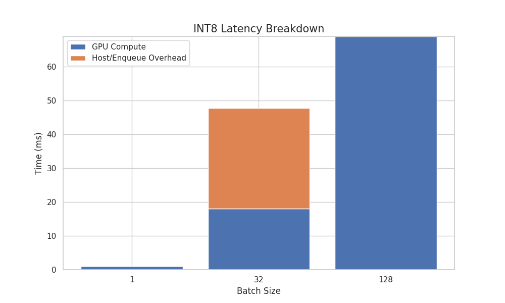

# TRTInferX Performance Report (KITTI Video)

*KITTI video demo: TRTInferX real-world video inference on YOLOv11 across multiple FP16/INT8 static and dynamic batch configurations, with the best-performing setup reaching 301.9 FPS and 0.57 ms GPU time (INT8 dynamic batch=16, Video summary FPS record).*

**Performance log**: [`docs/performance.txt`](performance.txt)

### Test Environment

- Computer: Lenovo Legion Y9000P IAH7H
- CPU: 12th Gen Intel Core i9-12900H
- GPU: NVIDIA GA106M (GeForce RTX 3060 Mobile / Max-Q)
- OS: Ubuntu 22.04.5 LTS
- CUDA: 13.0 (nvcc 13.0.48, Driver 580.95.05, CUDA runtime 13.0)
- TensorRT: 10.14.1 (system packages, libnvinfer/libnvinfer_plugin)
- OpenCV: 4.5.4 (system), 4.12.0 (conda/python)

---

* **Runtime**: TRTInferX example (video mode, TensorRT engine)
* **Metrics**:
  * **Throughput**: FPS (higher is better)
  * **Latency**: Infer / GPU time in ms (lower is better)
* **Reporting Rule**:
  For each configuration, we record the **steady-state FPS window average** printed by the log,
  and pair it with the **Infer/GPU values shown in the same log line** (per-frame averages for batch runs).
* **Notes**:
  * Dynamic-batch engines are tested with an explicit `--video-batch` value.
  * FPS is computed over ~1s windows; min/max FPS are reported separately at the end of a run.

---

### Metric Interpretation

* **Infer (ms)**
  End-to-end latency measured around `doInference()` in the example app.
  For batch inference, it is reported as **per-frame average** (`total / batch`).
  Includes CPU-side logic, H2D/D2H transfers, CUDA preprocessing, TensorRT inference, post-processing, and synchronization.
  This is the closest approximation to **application-level latency**.

* **GPU (ms)**
  GPU time measured with CUDA events around `enqueueV3()` only.
  Reflects **TensorRT execution time** (forward pass), excluding CPU logic, H2D/D2H transfers,
  CUDA preprocessing, and post-processing/NMS.
  This is the closest approximation to **raw model execution performance**.

* **FPS**
  Overall throughput of the full pipeline.
  The live FPS shown during inference is a **~1-second window average**, not a peak value.
  Min/Max FPS are reported separately at the end of video/camera runs.

---

### FP16 — Static Batch

| Precision Mode | Batch Size | FPS (avg) | Infer (ms / frame) | GPU (ms / frame) |
| :------------: | :--------: | :-------: | :----------------: | :--------------: |
| FP16           |     1      |  251.9    |       1.82         |       1.58       |
| FP16           |     4      |  255.0    |       1.35         |       1.15       |
| **FP16**       | **8**      | **262.5** | **1.23**           | **1.03**         |
| FP16           |     16     |  259.8    |       1.26         |       1.05       |

**Best (FP16 Static)**: **Batch=8**, **262.5 FPS**, **GPU 1.03 ms**

---

### FP16 — Dynamic Batch (1–16)

| Precision Mode | Batch Size | FPS (avg) | Infer (ms / frame) | GPU (ms / frame) |
| :------------: | :--------: | :-------: | :----------------: | :--------------: |
| FP16 Dynamic   |     1      |  208.2    |       2.50         |       2.27       |
| FP16 Dynamic   |     4      |  244.2    |       1.69         |       1.30       |
| FP16 Dynamic   |     8      |  261.7    |       1.24         |       1.04       |
| **FP16 Dynamic** | **16**   | **272.1** | **1.15**           | **0.95**         |

**Best (FP16 Dynamic)**: **Batch=16**, **272.1 FPS**, **GPU 0.95 ms**

---

### INT8 — Static Batch

| Precision Mode | Batch Size | FPS (avg) | Infer (ms / frame) | GPU (ms / frame) |
| :------------: | :--------: | :-------: | :----------------: | :--------------: |
| INT8           |     1      |  239.6    |       1.61         |       1.17       |
| INT8           |     4      |  262.7    |       1.03         |       0.73       |
| **INT8**       | **8**      | **290.7** | **0.93**           | **0.63**         |
| INT8           |     16     |  288.1    |       0.88         |       0.58       |

**Best (INT8 Static)**: **Batch=8**, **290.7 FPS**, **GPU 0.63 ms**

---

### INT8 — Dynamic Batch (1–16)

| Precision Mode  | Batch Size | FPS (avg) | Infer (ms / frame) | GPU (ms / frame) |
| :-------------: | :--------: | :-------: | :----------------: | :--------------: |
| INT8 Dynamic    |     1      |  262.0    |       1.61         |       1.23       |
| INT8 Dynamic    |     4      |  280.9    |       1.06         |       0.76       |
| INT8 Dynamic    |     8      |  286.5    |       0.93         |       0.63       |
| **INT8 Dynamic**| **16**     | **301.9** | **0.87**           | **0.57**         |

**Best (INT8 Dynamic)**: **Batch=16**, **301.9 FPS**, **GPU 0.57 ms**
**Global best throughput**: **301.9 FPS** (INT8 Dynamic, batch=16)
**Global lowest GPU latency**: **0.57 ms** (INT8 Dynamic, batch=16)

---
## Key Comparison Tables

**Notes**
- **FPS (images/s) = Throughput(qps) × Batch**.
- When **infStreams > 1**, `trtexec` warns that latency may be inaccurate; use Throughput/FPS for capacity comparisons.
- Output structure affects D2H and E2E:
  - **INT8 output**: `B×84×8400` (raw features, larger D2H cost)
  - **FP16 output**: `B×300×6` (post-processed, smaller D2H cost)

#### DataTransfers Impact (infStreams=1)

| engine         | precision | batch | fps_noXfer | fps_Xfer | delta_pct |
| :------------- | :-------- | ----: | ---------: | -------: | :-------- |
| best_fp16_b1   | FP16      |     1 |      731.9 |    579.8 | -20.8%    |
| best_fp16_b64  | FP16      |    64 |     1021.4 |    746.3 | -26.9%    |
| best_fp16_b128 | FP16      |   128 |     1004.5 |    727.7 | -27.6%    |
| best_int8_b1   | INT8      |     1 |      966.7 |    880.6 | -8.9%     |
| best_int8_b32  | INT8      |    32 |     1769.7 |   1315.8 | -25.6%    |
| best_int8_b128 | INT8      |   128 |     1858.3 |   1427.8 | -23.2%    |

#### infStreams=2 vs infStreams=1 Throughput

| engine         | precision | batch | transfers | fps_s1 | fps_s2 | delta_pct | ctx_mem_per_stream_mib |
| :------------- | :-------- | ----: | :-------- | -----: | -----: | :-------- | ---------------------: |
| best_fp16_b1   | FP16      |     1 | NoXfer    |  731.9 |  743.2 | 1.6%      |                    9.5 |
| best_fp16_b1   | FP16      |     1 | Xfer      |  579.8 |  571.0 | -1.5%     |                    9.5 |
| best_fp16_b64  | FP16      |    64 | NoXfer    | 1021.4 | 1027.9 | 0.6%      |                  662.6 |
| best_fp16_b64  | FP16      |    64 | Xfer      |  746.3 |  735.4 | -1.5%     |                  662.6 |
| best_fp16_b128 | FP16      |   128 | NoXfer    | 1004.5 | 1014.8 | 1.0%      |                 1325.4 |
| best_fp16_b128 | FP16      |   128 | Xfer      |  727.7 |  720.2 | -1.0%     |                 1325.4 |
| best_int8_b1   | INT8      |     1 | NoXfer    |  966.7 | 1281.5 | 32.6%     |                    8.3 |
| best_int8_b1   | INT8      |     1 | Xfer      |  880.6 | 1074.2 | 22.0%     |                    8.3 |
| best_int8_b32  | INT8      |    32 | NoXfer    | 1769.7 | 1802.4 | 1.8%      |                  256.6 |
| best_int8_b32  | INT8      |    32 | Xfer      | 1315.8 | 1522.7 | 15.7%     |                  256.6 |
| best_int8_b128 | INT8      |   128 | NoXfer    | 1858.3 | 1836.4 | -1.2%     |                 1026.6 |
| best_int8_b128 | INT8      |   128 | Xfer      | 1427.8 | 1367.4 | -4.2%     |                 1026.6 |

---

## Comprehensive Inference Performance Analysis Table

**Performance log**: [`docs/performance.txt`](performance.txt)

| Precision | Batch Size | Throughput (QPS) | **FPS (frames/sec)** | Avg Latency (ms) | P99 Latency (ms) | GPU Compute (ms) | Host Scheduling (ms) | Overhead Share | Stability (COV) | Runtime Assessment |
| :-------: | :--------: | :--------------: | :------------------: | :--------------: | :--------------: | :-------------: | :------------------: | :------------: | :-------------: | :----------------: |
| **INT8**  | 1   | 966.75 | 966.75 | 1.03 | 1.60 | 1.03 | ~0.00 | 0.0% | 11.60% | Low-latency |
| **INT8**  | 32  | 41.12  | 1,315.80 | 47.67 | 51.67 | 18.07 | 29.60 | **62.1%** | 7.63% | **Scheduler-bound** |
| **INT8**  | 128 | 14.52  | **1,858.32** | 68.88 | 74.70 | 68.88 | < 0.01 | 0.0% | 5.40% | **Fully saturated (best)** |
| **FP16**  | 1   | 731.87 | 731.87 | 1.36 | 2.13 | 1.36 | ~0.00 | 0.0% | 12.17% | Responsive |
| **FP16**  | 64  | 11.66  | 746.28 | 85.80 | 90.67 | 56.91 | 28.89 | **33.7%** | 3.87% | Scheduling overhead |
| **FP16**  | 128 | 7.85   | 1,004.47 | 127.42 | 143.63 | 127.42 | < 0.01 | 0.0% | 3.53% | Highly stable |

---

  
  
<em>FPS vs Batch.</em>

  
  
<em>Mean Latency vs Batch.</em>

  
  
<em>INT8 Latency Breakdown.</em>

---

### Key Insights and Analysis

1. **Peak Performance**
* **INT8 Batch 128** is the best-performing configuration in this test, reaching **1,858.32 FPS**, about **85%** higher than the best FP16 configuration.

2. **Bottleneck Warning**
* **INT8 Batch 32** shows clear inefficiency: GPU compute is only **18.07 ms**, but total latency is **47.67 ms**, and **62.1%** of time is spent on host enqueue/scheduling.
* **Recommendation**: For scheduler-bound scenarios, consider **CUDA Graphs** to reduce CPU scheduling overhead.

3. **Compute Utilization**
* As batch size increases, **INT8** scales efficiently (from 966 FPS at batch 1 to 1,858 FPS at batch 128).
* **FP16** scales less effectively at large batch sizes, indicating an approach to hardware throughput or bandwidth limits.

4. **Stability Trend**
* The **COV** drops noticeably with larger batch sizes, indicating more deterministic latency under high-load conditions.

5. **D2H Latency Note**
* The log shows `D2H Latency: mean = 0 ms`, which indicates `--noDataTransfers` was used (or host transfers were negligible).
  This means the results primarily reflect core compute performance without PCIe bandwidth influence,
  making the precision/batch comparisons more representative of pure GPU capability.

**Conclusion**: For maximum throughput, choose **INT8 + Batch 128**; for minimum single-request latency, choose **INT8 + Batch 1**.

---

### Full trtexec Benchmark Tables (InferTime.txt)

**Data source**: `performance.txt` (`trtexec` performance summaries).
**Derived metric**: `Effective FPS = Throughput(qps) × batch`.
**Modes**:
- **Compute-only** = `--noDataTransfers` (H2D/D2H excluded)
- **E2E** = default (H2D/D2H included)

#### INT8 — All Results

| Batch | infStreams | Mode | Throughput (qps) | Effective FPS (img/s) | Mean Latency (ms) | H2D Mean (ms) | D2H Mean (ms) | GPU Compute Mean (ms) |
| :---: | :--------: | :--: | :--------------: | :-------------------: | :---------------: | :-----------: | :-----------: | :-------------------: |
| 1   | 1 | Compute-only | 966.7460 | 966.75  | **1.032** | **0.000** | **0.000** | **1.029** |
| 1   | 2 | Compute-only | **1281.4500** | 1281.45 | 1.558 | **0.000** | **0.000** | 1.521 |
| 1   | 1 | E2E         | 880.6370 | 880.64  | 1.893 | 0.474 | 0.292 | 1.128 |
| 1   | 2 | E2E         | **1074.2300** | 1074.23 | 2.636 | 0.482 | 0.292 | 2.279 |
| 32  | 1 | Compute-only | 55.9160 | 1789.31 | 17.862 | **0.000** | **0.000** | 17.860 |
| 32  | 2 | Compute-only | 56.5579 | 1809.85 | 35.367 | **0.000** | **0.000** | 35.358 |
| 32  | 1 | E2E         | 41.1293 | 1316.14 | 47.651 | 20.191 | 13.340 | 47.600 |
| 32  | 2 | E2E         | **47.5831** | **1522.66** | 57.963 | 20.202 | 13.340 | 57.955 |
| 128 | 1 | Compute-only | 14.5181 | **1858.32** | 68.884 | **0.000** | **0.000** | 68.877 |
| 128 | 2 | Compute-only | 14.3466 | 1836.36 | 138.966 | **0.000** | **0.000** | 138.883 |
| 128 | 1 | E2E         | 11.1546 | 1427.79 | 177.415 | 67.706 | 43.217 | 177.265 |
| 128 | 2 | E2E         | 10.6830 | 1367.42 | 186.890 | 92.815 | 53.910 | 186.545 |

#### FP16 — All Results

| Batch | infStreams | Mode | Throughput (qps) | Effective FPS (img/s) | Mean Latency (ms) | H2D Mean (ms) | D2H Mean (ms) | GPU Compute Mean (ms) |
| :---: | :--------: | :--: | :--------------: | :-------------------: | :---------------: | :-----------: | :-----------: | :-------------------: |
| 1   | 1 | Compute-only | 731.8740 | 731.87  | **1.362** | **0.000** | **0.000** | **1.359** |
| 1   | 2 | Compute-only | **743.4250** | 743.43  | 2.331 | **0.000** | **0.000** | 2.329 |
| 1   | 1 | E2E         | **579.8070** | 579.81  | 1.718 | 0.446 | 0.292 | 1.268 |
| 1   | 2 | E2E         | 570.9850 | 570.99  | 1.737 | 0.445 | 0.292 | 1.398 |
| 64  | 1 | Compute-only | 14.9343 | 955.80  | 68.976 | **0.000** | **0.000** | 68.903 |
| 64  | 2 | Compute-only | 16.0615 | **1027.94** | 124.408 | **0.000** | **0.000** | 124.367 |
| 64  | 1 | E2E         | 11.6606 | **746.28**  | 84.516 | 28.804 | 0.079 | 84.300 |
| 64  | 2 | E2E         | 11.4899 | 735.35  | 85.802 | 28.818 | 0.079 | 85.678 |
| 128 | 1 | Compute-only | 7.8475 | 1004.48 | 124.866 | **0.000** | **0.000** | 124.818 |
| 128 | 2 | Compute-only | 7.9285 | 1014.85 | 125.694 | **0.000** | **0.000** | 125.660 |
| 128 | 1 | E2E         | 5.6849 | 727.67  | 175.980 | 57.738 | 0.139 | 175.854 |
| 128 | 2 | E2E         | 5.6900 | 728.32  | 278.411 | 57.744 | 0.139 | 277.475 |

---

### Consolidated Findings 

**Peak throughput (Compute-only, NoDataTransfers)**
- **INT8, batch=128, infStreams=1**: **14.5181 qps → 1858.3 FPS**
- **FP16 peak** at **batch=64, infStreams=2**: **16.0615 qps → 1027.9 FPS**

**Throughput drop with data transfers (E2E)**
- **INT8 batch=128 (infStreams=1)**: **1858.3 → 1427.8 FPS (-23.2%)**
- **FP16 batch=128 (infStreams=1)**: **1004.5 → 727.7 FPS (-27.6%)**

**infStreams=2 impact (batch-dependent)**
- **INT8 batch=1** improves notably:
  - NoXfer: **966.7 → 1281.5 qps (+32.6%)**
  - Xfer: **880.6 → 1074.2 qps (+22.0%)**
- **Large batches (64/128)** show marginal gains or regressions, while **VRAM usage scales ~linearly** with stream count (extra execution context/workspace per stream).

**E2E bottleneck breakdown (DataTransfers enabled, infStreams=1)**
- **INT8 batch=128**: **Latency(mean)=177.478 ms/batch**
  - H2D **38.15%** (67.706 ms) + GPU **37.50%** (66.555 ms) + D2H **24.35%** (43.217 ms)
- **FP16 batch=128**: **Latency(mean)=175.980 ms/batch**
  - H2D **32.81%** (57.739 ms) + GPU **67.11%** (118.102 ms) + D2H **0.08%** (0.139 ms)

**Best configurations by objective**
- **Max compute throughput**: **INT8 / batch=128 / infStreams=1 / --noDataTransfers**
- **Max end-to-end throughput**: **INT8 / batch=32 / infStreams=2 / DataTransfers enabled**
  - **47.5831 qps → ~1523 FPS**
- **Lowest end-to-end latency**: **FP16 / batch=1 / infStreams=1 / DataTransfers enabled**
  - **579.807 qps, Latency(mean)=1.718 ms**

**Interpretation**
- For **maximum throughput**, use **INT8 with large batch**, but expect **transfer-dominated E2E costs** due to raw output size.
- For **low latency**, **batch=1** dominates; **FP16** is typically cleaner for E2E latency even if INT8 has higher throughput.

**Transfer overhead note (INT8, batch=128, infStreams=1)**
- H2D + D2H ≈ **110.9 ms**, about **62%** of total latency, making transfers the dominant E2E bottleneck.

**infStreams=2 is not universally better**
- **INT8 batch=128 (E2E)**: **10.683 qps, 186.89 ms** vs **11.1546 qps, 177.415 ms** at infStreams=1 (worse throughput and latency).

Reference : **Performance log**: [`docs/performance.txt`](performance.txt)

---

  

Copyright © 2026 ROBOMASTER · 华北理工大学 HORIZON 战队 · 雷达组 - YAOYUZHUO 
Licensed under the GNU Affero General Public License v3.0 (AGPL-3.0). 
Use, modification, and redistribution are permitted under the terms of AGPL-3.0. 
The complete corresponding source must be made available. 
2026 年 01 月 08 日

